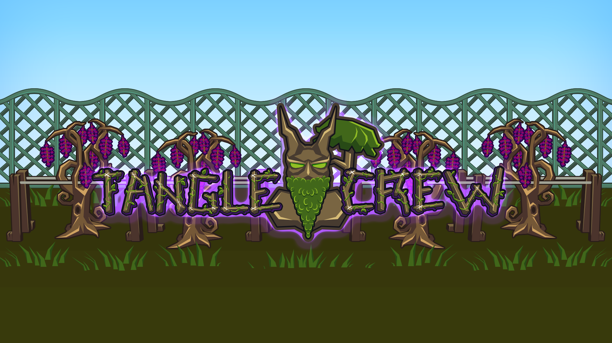

# Tanglebot

A Discord bot built for the **Tangle Crew** clan in [Old School RuneScape](https://oldschool.runescape.com/).

> **This bot was built with the assistance of [Claude](https://claude.ai/) by Anthropic — an AI coding assistant that helped design, write, debug, and iterate on all of the features described below.**

---

## Tangle Crew

| | |
|---|---|
| **Discord** | [https://discord.gg/tanglecrew](https://discord.gg/tanglecrew) |
| **Wise Old Man** | [wiseoldman.net/groups/12447](https://wiseoldman.net/groups/12447) |
| **OSRS Clan Finder** | [https://osrsclanfinder.com/clans/tangle-crew](https://osrsclanfinder.com/clans/tangle-crew) |

---

## Commands

### 🎡 `/spinwheel` — Prize Wheel

Spins an animated prize wheel and picks one or more random winners from a list of entries — giveaways, loot splits, event prizes, or deciding between activities.

**Options:**

| Option | Required | Description |
|--------|----------|-------------|
| `entries` | Yes | Comma-separated names or numeric ranges, e.g. `Alice,Bob,Carol` or `1-10` or `Alice,1-5,Bob`. Ranges auto-expand (`5-1` counts down too). |
| `title` | No | Label shown on the wheel (default: `Wheel Spin`) |
| `winners` | No | How many winners to pick (1–10, default: 1) |
| `message` | No | Custom win message — use `{winner}` as a placeholder |
| `shuffle` | No | Shuffle entry order before spinning |
| `ping` | No | Send an `@here`/`@everyone` notification when the winner is announced |

Restricted to the **Coordinator** role.

<details>
<summary><strong>Environment variables</strong></summary>

| Variable | Required | Description |
|---|---|---|
| `COORDINATOR_ROLE_ID` | Yes | Only role allowed to run `/spinwheel`. Fails **closed** — unset means no one can use it, not even the Owner. |

</details>

<details>
<summary><strong>How it works</strong></summary>

Renders an animated GIF of the wheel spinning to a stop, then edits the message to reveal the winner and full entry list. If `ping` was set, a short follow-up triggers the notification.

</details>

---

### 💰 `/donationhighscore` — Donation High Scores

Tracks each member's total GP donated in a Google Sheet, posts a ranked leaderboard embed, and assigns donation tier roles (Zenyte/Onyx/Dragonstone/Diamond/Ruby) from configurable GP thresholds.

**Subcommands:**

| Subcommand | Description |
|------------|-------------|
| `add` | Adds an amount to a member's donation total |
| `remove` | Subtracts an amount (for fixing mistakes) |

Both take `player` and `amount` — raw numbers or shorthand (`10m`, `10k`, `1b`, `10.1m`) work.

Restricted to **Templar**. Only loaded if `DONATIONS_SHEET_ID`, `DONATIONS_CHANNEL_ID`, and `GOOGLE_SERVICE_ACCOUNT_JSON` are set.

<details>
<summary><strong>Environment variables</strong></summary>

| Variable | Required | Description |
|---|---|---|
| `DONATIONS_SHEET_ID` | Yes | The Google Sheet's ID. |
| `DONATIONS_CHANNEL_ID` | Yes | Channel where the leaderboard is posted. |
| `GOOGLE_SERVICE_ACCOUNT_JSON` | Yes | Shared across Sheets features — see [Google service account](#google-service-account). |
| `TEMPLAR_ROLE_ID` | Recommended | Restricts `add`/`remove` to Templars. Fails **open** if unset — usable by anyone. |
| `DONATION_ZENYTE_THRESHOLD` / `_ONYX_` / `_DRAGONSTONE_` / `_DIAMOND_` / `_RUBY_THRESHOLD` | No | GP thresholds per tier (defaults: 1B / 600M / 300M / 150M / 75M). |
| `DONATION_ZENYTE_ROLE_ID` / `_ONYX_` / `_DRAGONSTONE_` / `_DIAMOND_` / `_RUBY_ROLE_ID` | No | Role granted at each tier (tiers stack). Blank skips that tier's role management. |
| `DEFAULT_EMBED_COLOR` | No | Shared accent color across features (default `006400`). |

</details>

<details>
<summary><strong>How it works</strong></summary>

Reads or creates the member's sheet row by Discord ID, applies the add/subtract (`remove` clamps at 0), and writes it back. Assigns the highest qualifying tier role plus every tier below it (tiers stack), removing any no-longer-qualified tier. Rebuilds the leaderboard embed — combined total as the heading, one line per member with their tier emoji, sorted highest-first, departed members shown by their last known name — and posts it or edits the existing message(s) in place, no duplicates.

</details>

<details>
<summary><strong>Setup</strong></summary>

1. Copy `Tanglebot/example/donationhighscores_template.xlsx` into a new Google Sheet: [sheets.google.com](https://sheets.google.com) → **File → Import → Upload** → select the file → **Create new spreadsheet** (not "Insert sheet(s)" or opening it from Drive — those can leave it in Office-compatibility mode, which the Sheets API can't write to). Keeps its `Donations` tab (`DiscordID`, `DisplayName`, `Donated`) by exact name — don't rename it. Clear the example rows if unwanted.
2. Share the sheet with your [service account](#google-service-account) as an **Editor**.
3. Set `DONATIONS_SHEET_ID` (from the sheet's URL) and `DONATIONS_CHANNEL_ID`.
4. Optionally set the threshold and role ID vars above to enable tier roles.

> **Note:** Role management needs the **Manage Roles** permission, with the bot's role positioned **above** the donation tier roles.

</details>

---

### 🐾 `/pethighscore` — Pet High Scores

Tracks which OSRS pets each member has collected in a Google Sheet, posts a ranked leaderboard embed, and grants a Pet Master role at a configurable pet count.

**Subcommands:**

| Subcommand | Description |
|------------|-------------|
| `add` | Adds a pet to a member's collection |
| `remove` | Removes a pet (for fixing mistakes) |
| `new` | Registers a new pet type — **Owner only** |

`add`/`remove` take `user` + `pet` (autocompletes). `new` takes `name` + `emoji` and appends it to the sheet's `Pets` tab live — no restart needed, immediately available in autocomplete.

Restricted to **Templar** (`new` requires **Owner**). Only loaded if `PET_HIGHSCORES_SHEET_ID`, `PET_HIGHSCORES_CHANNEL_ID`, and `GOOGLE_SERVICE_ACCOUNT_JSON` are set.

<details>
<summary><strong>Environment variables</strong></summary>

| Variable | Required | Description |
|---|---|---|
| `PET_HIGHSCORES_SHEET_ID` | Yes | The Google Sheet's ID. |
| `PET_HIGHSCORES_CHANNEL_ID` | Yes | Channel where the leaderboard is posted. |
| `GOOGLE_SERVICE_ACCOUNT_JSON` | Yes | Shared across Sheets features — see [Google service account](#google-service-account). |
| `TEMPLAR_ROLE_ID` | Recommended | Restricts `add`/`remove`. Fails **open** if unset. |
| `OWNER_ROLE_ID` | Recommended | Restricts `new`. Fails **open** if unset. |
| `PET_MASTER_ROLE_ID` | No | Role granted at `PET_MASTER_THRESHOLD` pets. Blank skips role management. |
| `PET_MASTER_THRESHOLD` | No | Pet count needed for Pet Master (default `10`). |
| `DEFAULT_EMBED_COLOR` | No | Shared accent color across features (default `006400`). |

</details>

<details>
<summary><strong>How it works</strong></summary>

Reads or creates the member's sheet row, adds/removes the pet (kept in the `Pets` tab's fixed order regardless of log order), writes it back, and rebuilds the leaderboard — mention, pet count, an enlarged row of pet emojis, sorted highest-first, departed members shown by their last known name — posting or editing in place. Crossing `PET_MASTER_THRESHOLD` in either direction grants or revokes the role.

</details>

<details>
<summary><strong>Setup</strong></summary>

1. Copy `Tanglebot/example/pethighscores_template.xlsx` into a new Google Sheet the same way as [`/donationhighscore`](#-donationhighscore--donation-high-scores) above. Keeps two tabs by exact name: `Highscores` (`DiscordID`, `DisplayName`, `Pets` — a comma-separated list of pet *keys*, not display names) and `Pets` (the catalog: `Key`, `Name`, `EmojiID`). Don't rename either tab.
2. Share the sheet with your [service account](#google-service-account) as an **Editor**.
3. Set `PET_HIGHSCORES_SHEET_ID` and `PET_HIGHSCORES_CHANNEL_ID`.
4. Optionally set `PET_MASTER_ROLE_ID`/`PET_MASTER_THRESHOLD` to have the bot manage the role.
5. Fill in each pet's `EmojiID` on the `Pets` tab (upload the emoji first, then copy its ID) — a blank ID shows a ❔ placeholder instead of failing. New pets can be added as a row directly or via `/pethighscore new`; the bot caches this tab at startup and stays in sync as `new` adds rows, but a manual edit to an existing row needs a restart.

> **Note:** Role management needs the **Manage Roles** permission, with the bot's role positioned **above** the Pet Master role.

</details>

---

### 🔄 `/refreshboards` — Refresh Leaderboards

Reposts every leaderboard (`/pethighscore`, `/donationhighscore`) straight from their sheets — useful after bulk-editing a sheet by hand, without a throwaway `add`/`remove` or a restart.

Restricted to **Templar**. Only loaded if `GOOGLE_SERVICE_ACCOUNT_JSON` is set.

<details>
<summary><strong>Environment variables</strong></summary>

| Variable | Required | Description |
|---|---|---|
| `GOOGLE_SERVICE_ACCOUNT_JSON` | Yes | See [Google service account](#google-service-account). |
| `TEMPLAR_ROLE_ID` | Recommended | Fails **open** if unset. |

</details>

<details>
<summary><strong>How it works</strong></summary>

Runs each leaderboard's own startup-refresh routine and edits its existing message(s) in place. A board whose own env vars aren't set is skipped rather than failing the whole command.

</details>

---

### 🏅 `/clanranks` — Automatic Clan Rank Roles

Manages a ladder of tenure-based rank roles (e.g. Recruit → Member → Veteran → Elite), auto-created and styled from a config file, kept in sync with each member's clan tenure via [Wise Old Man](https://wiseoldman.net/). Runs on a configured cron schedule (weekly by default): reports pending changes to the admin log, then applies them — ranks only change there or via a manual `/clanranks sync`.

**Subcommands** (all restricted to **Owner**):

| Subcommand | Description |
|------------|-------------|
| `setup` | Creates/refreshes the Discord role for every rank in `clan-ranks.json` |
| `preview` | Shows pending changes without applying anything or posting to admin log |
| `sync` | Runs the full sync now: posts the report, then applies it |
| `add` | Links (or updates) a member's RSN — `member` + `rsn` |
| `unlink` | Removes a member's RSN link |
| `firstrun` | Seeds the RSN sheet from the current member list, auto-matching against WOM |

Only loaded if `WOM_GROUP_ID`, `CLAN_RANKS_SHEET_ID`, and `GOOGLE_SERVICE_ACCOUNT_JSON` are set.

<details>
<summary><strong>Environment variables</strong></summary>

| Variable | Required | Description |
|---|---|---|
| `WOM_GROUP_ID` | Yes | The clan's WOM group ID (from `wiseoldman.net/groups/<ID>`). |
| `CLAN_RANKS_SHEET_ID` | Yes | The RSN-link Google Sheet's ID. |
| `GOOGLE_SERVICE_ACCOUNT_JSON` | Yes | Shared across Sheets features — see [Google service account](#google-service-account). |
| `CLAN_ID` | Yes | The Discord server ID — see [Environment variables](#environment-variables) under Setup. |
| `OWNER_ROLE_ID` | Recommended | Restricts every subcommand. Fails **open** if unset. |
| `WOM_API_KEY` | No | Sent as `x-api-key`; only needed if you hit WOM's rate limits. |
| `ADMIN_LOG_CHANNEL_ID` | Recommended | Where the change report is posted. Sync still applies without it. |
| `CLAN_RANKS_CRON` | No | 5-field cron expression (UTC) for when the sync runs. Default `0 0 * * 0` (Sunday 00:00 UTC); falls back to it if unset/invalid. |
| `GUEST_ROLE_ID` | No | Anyone holding this role is fully ignored — not tracked, promoted, or seeded. |

The rank ladder itself (names, emoji, colors, thresholds, static flags) isn't an env var — it lives in `Tanglebot/data/clan-ranks.json` (see Setup below).

</details>

<details>
<summary><strong>How it works</strong></summary>

- **Tenure** comes from WOM's `clientSyncJoinedAt` — the actual in-game join date, backfilled by WOM's clan-chat sync plugin, not just when WOM started tracking the account. A member's rank is the highest configured rank whose `daysRequired` doesn't exceed their tenure.
- **Linking** happens via the `RankLinks` sheet (`DiscordID`, `DisplayName`, `RSN`, `WomPlayerId`, `CurrentRank`). Once matched, the player's numeric ID is stored so a later in-game RSN change is detected, auto-corrected, and reported instead of losing the link.
- **Sync:** ensures every rank's role exists → computes each linked member's current vs. qualified rank → posts one report embed (changes, RSN corrections, unmatched links) → applies it and writes each member's resulting rank into the sheet's `CurrentRank` column. A member ends up holding **exactly one** rank role — every other ladder role is stripped, self-healing any accidental double-assignment.
- **Static ranks** (`"static": true`) get a managed role but are never auto-added/removed — for hand-assigned honorifics (Owner, Coordinator). Roles unrelated to the ladder need no configuration here.
- **Ignored ranks** (`"ignore": true`) are skipped entirely by `/clanranks setup` — no role is created or styled for them, for entries that are already managed elsewhere (the donation tier roles, owned by `/donationhighscore`) or need zero bot involvement (Gnome Child, hand-assigned alt accounts). A member currently holding an ignored rank's role (e.g. Templar) is also left alone by the sync entirely — no ladder rank is computed or applied for them, since the hand-assigned role takes precedence; `CurrentRank` shows that role's name instead. A member with no ignored role gets the normal tenure-based ladder rank as usual.
- Rank roles are created **not** mentionable, with **no name prefix** — `"Veteran"` becomes a role literally named `Veteran`.
- `firstrun` seeds `RankLinks` from the WOM group's member list (the source of truth for who's actually in the clan), fuzzy-matching each WOM player against Discord nicknames/usernames (including text in parentheses or after `|`/`/`). Confident matches are filled in automatically; plausible ones are listed in the reply for manual confirmation; a WOM member with no plausible Discord match is reported but not added (no Discord ID to key a row on).
- `GUEST_ROLE_ID` holders are invisible to the whole system until the role is removed — no re-linking needed afterward.

</details>

<details>
<summary><strong>Setup</strong></summary>

1. `Tanglebot/data/clan-ranks.json` is tracked directly in the repo (unlike the rest of `Tanglebot/data/`, which is gitignored runtime state) — edit it in place to your rank ladder and commit. Each entry: `key` (unique), `name` (exact Discord role name), `emoji` (numeric ID or unicode, blank for none), `color` (hex, blank for none), `daysRequired`, and optionally `"static": true` (`daysRequired` is still required but ignored for static ranks) and `"ignore": true`. `Tanglebot/example/clan-ranks.example.json` is a starting template.
2. Make a copy of `Tanglebot/example/clanranks_template.xlsx` as your live Google Sheet, the same way described under [`/pethighscore`](#-pethighscore--pet-high-scores). Keeps its `RankLinks` tab by exact name — don't rename it. Add a `CurrentRank` header in column E if the template doesn't already have one — the sync writes each member's resulting rank there.
3. Share the sheet with your [service account](#google-service-account) as an **Editor**.
4. Create/find your clan's WOM group at [wiseoldman.net](https://wiseoldman.net) (ideally with the clan-chat sync plugin for accurate join dates) and set `WOM_GROUP_ID`.
5. Set `CLAN_RANKS_SHEET_ID` and `OWNER_ROLE_ID`.
6. Recommended first run: `/clanranks firstrun` → fix up RSNs in the sheet → `/clanranks setup` → `/clanranks preview` to sanity-check → wait for the scheduled sync or run `/clanranks sync`.
7. Optionally set `CLAN_RANKS_CRON` to change the schedule.

> **Note:** Role management needs the **Manage Roles** permission, with the bot's role positioned **above** every rank role.

</details>

---

### 🔔 `/lfg-roles` — Event Notification Roles

Lets members self-assign notification roles for specific bosses, raids, and skilling/minigame activities, so they only get pinged for what they're interested in.

<details>
<summary><strong>Environment variables</strong></summary>

No environment variables are required — activity roles are auto-created on demand.

| Variable | Required | Description |
|---|---|---|
| `ADMIN_LOG_CHANNEL_ID` | No | Shared admin alerts channel (also used by `/lfg-post` and the honeypot trap). |

</details>

<details>
<summary><strong>How it works</strong></summary>

Opens a private menu: **Bosses / Raids / Minigames** → specific activity. Clicking an activity toggles that role on/off (selected roles turn red). Anyone can `@mention` an activity role to notify everyone who's opted in. **Clear All LFG Roles** removes every `LFG-` role the member has in one click.

</details>

<details>
<summary><strong>Setup</strong></summary>

Missing activity roles (`LFG-<name>`, full list in `src/utils/roleMenu.js`) are auto-created and colored/icon-tagged the first time they're needed — no manual setup. On startup, if `CLAN_ID` is set, the bot also re-syncs color/icon onto every existing `LFG-` role, so later edits to `CATEGORIES` reach roles created before the change. Needs **Manage Roles**, with the bot's role positioned above the `LFG-` roles.

</details>

---

### 🔍 `/lfg-post` — Looking For Group (Forum Posts)

Creates a post in a configured Forum Channel so members can find and join a group for an activity, with automatic role pings, live member tracking, and self-cleanup.

<details>
<summary><strong>Environment variables</strong></summary>

| Variable | Required | Description |
|---|---|---|
| `LFG_FORUM_CHANNEL_ID` | Yes | Forum Channel where groups get created. |
| `COORDINATOR_ROLE_ID` / `OWNER_ROLE_ID` | No | Lets staff Disband or Start Now any group, not just their own. Unset means only current members can manage a group. |
| `SUPABASE_URL` + `LFG_PLUGIN_TOKEN` | No | Mirrors groups to/from the RuneLite plugin. `SUPABASE_URL` is shared with the proof intake feature below. |
| `LFG_DELIVERY_SECRET` | No | Needed on top of the above to push the category catalog to Supabase and run the delivery worker. |
| `ADMIN_LOG_CHANNEL_ID` | No | Shared admin alerts channel. |

</details>

<details>
<summary><strong>How it works</strong></summary>

A private step-by-step menu (Category → Activity → Group Size → Start Time) creates a forum post pinging the matching role, with a live member list. **Join**/**Leave** update it in place; routine join/leave churn posts a quiet notice with no group-wide ping. Once full, the post locks and pings everyone; if people are queued when a spot frees up, the front of the queue gets a 5-minute Accept/Decline offer. **Disband** posts a 1-minute closing notice with a Cancel button first. An empty group auto-closes after 15 minutes; any active group also gets a 2-hour keep-alive check that auto-disbands if no one responds within 10 minutes. On startup the bot posts/updates a pinned "Start Here" walkthrough thread.

**Shared LFG sync:** with `SUPABASE_URL`+`LFG_PLUGIN_TOKEN` set, Discord-created groups mirror to the RuneLite plugin's backend and vice versa — plugin-created groups are delivered into Discord as their own posts.

</details>

<details>
<summary><strong>Advanced: queue, keep-alive &amp; plugin-synced posts</strong></summary>

- **Join Group** always shows the same label; if the group is full, clicking it queues you instead of erroring.
- **Leave Group** doubles as "leave the queue" when queued rather than a member.
- **Start Now**/**Disband Group** are limited to group members or Coordinator+ staff.
- **Queue:** FIFO, numbered in the embed. A freed spot reopens to the public Join button if no one's queued, or offers the front of the queue a private 5-minute Accept/Decline (a missed offer cycles them to the back).
- **Keep-alive:** every 2 hours, a **Still Here** button posts to the thread; no response within 10 minutes auto-disbands the group.
- **Disband grace period:** a 1-minute **Cancel Disband** window before the post actually closes.
- **Plugin-synced posts** render with separate Join/Leave/Close buttons reflecting synced status (`OPEN`/`FULL`/`STARTED`/`CLOSED`/`CANCELLED`/`EXPIRED`); Join stays enabled at `FULL` since the backend auto-queues.

</details>

<details>
<summary><strong>Setup</strong></summary>

`LFG_FORUM_CHANNEL_ID` must point to an actual Forum Channel. Uses the same auto-created activity roles as `/lfg-roles`, plus **Manage Threads** (to rename/delete forum posts).

</details>

---

### 🧾 `/submission` — Proof Submission Help

Posts the accepted KC/drop proof formats or shows the latest accepted proof submission.

**Subcommands:**

| Subcommand | Description |
|------------|-------------|
| `format` | Posts the KC and drop proof formats for players |
| `last` | Shows the latest accepted KC or drop proof submission |
| `showintakeurl` | Shows the current Discord KC intake URL |
| `setintakeurl` | Stores a local override for the intake URL |

`format`/`last` support a `private` option to reply only to the caller (default: public, for posting the format in a submission channel). `showintakeurl`/`setintakeurl` require **Manage Server** and reply ephemerally; `setintakeurl` writes a local override so the intake endpoint can change without editing `.env` or restarting.

<details>
<summary><strong>Environment variables</strong></summary>

None required to load `/submission` itself — `last` just has nothing to show until [KC and Drop Proof Intake](#kc-and-drop-proof-intake) below is configured and has accepted a submission.

</details>

### `/channelmap` — Show Channel ID

Restricted to **Manage Server** permission. Replies ephemerally with the channel mention/ID, the value to paste into `event_discord_channels.channel_id`, and a reminder that routing comes from the web panel / Supabase channel row.

---

## Message Features

### KC and Drop Proof Intake

When configured, watches linked Discord channels for KC and drop proof posts and forwards valid submissions to the site for review — no slash command required.

<details>
<summary><strong>Environment variables</strong></summary>

| Variable | Required | Description |
|---|---|---|
| `SUPABASE_URL` | Yes (all four, or none) | Shared with the LFG backend sync above. |
| `SUPABASE_SERVICE_ROLE_KEY` | Yes (all four, or none) | Queries `event_discord_channels` and forwards submissions. |
| `SUPABASE_DISCORD_KC_INTAKE_URL` | Yes (all four, or none) | Endpoint submissions are forwarded to. Overridable via `/submission setintakeurl`. |
| `DISCORD_KC_INTAKE_SECRET` | Yes (all four, or none) | Shared secret sent with forwarded submissions. |

**Warning:** setting some but not all four throws at startup and crashes the bot — set all four, or leave all four unset.

</details>

<details>
<summary><strong>How it works</strong></summary>

Resolves the event by querying `event_discord_channels` for a matching `channel_kind = submission` row, caching briefly and ignoring channels with no configured event. Supported KC format:

```text
Task name on Board: <tile title>
Monster being Killed: <monster name>
Starting or Ending: Starting
Starting Kill Count: 1234
```

Supported drop format:

```text
Task name on Board: <tile title>
Item Dropped: <item name>
```

`Monster being Killed` is optional; blank lines in the body are fine. Each submission needs exactly one image attachment. Ending KC submissions accept `Starting or Ending: Ending`, `Ending Kill Count: 1234`, or `Kill Count: 1234`. Only messages with an image attachment or recognizable proof fields are treated as submission attempts, so ordinary chat is ignored; validation failures ask for a resubmit, and a failed Supabase lookup asks the user to retry instead of crashing.

</details>

---

### Announcement Channel Cleanup

When configured, watches a designated announcement channel and deletes crossposted messages Discord has replaced with `[Original Message Deleted]` — this happens when a followed external announcement's original post is later removed.

<details>
<summary><strong>Environment variables</strong></summary>

| Variable | Required | Description |
|---|---|---|
| `ANNOUNCEMENT_CHANNEL_ID` | Yes | Channel to watch for crosspost cleanup. Leave blank to disable. |

> **Note:** Needs the **Manage Messages** permission in the configured channel.

</details>

---

### Honeypot Channel Trap

When configured, turns one or more designated channels into traps for scam bots/compromised accounts, timing out anyone who posts there and alerting staff.

<details>
<summary><strong>How it works</strong></summary>

Each trap channel is cleared and posted with a warning embed on startup. Anyone (non-bot) who posts in a trap channel is timed out for 1 week, their message deleted (image attachments re-uploaded to the report, up to Discord's 10-image limit), and a report sent to `ADMIN_LOG_CHANNEL_ID` with **Ban & Delete Messages** (bans and best-effort deletes their recent messages server-wide) and **False Positive (Un-Timeout)** buttons, restricted to `OWNER_ROLE_ID`/`TEMPLAR_ROLE_ID`. Once either is clicked, both buttons are removed and the embed gains an "Action Taken" record.

`/honeypot testmode true` dry-runs the trap (report posts, buttons work, nothing actually happens); `/honeypot testmode false` goes back to live; `/honeypot status` shows the current mode.

</details>

<details>
<summary><strong>Environment variables</strong></summary>

| Variable | Required | Description |
|---|---|---|
| `HONEYPOT_CHANNEL_ID` | Yes (either this or below) | A text channel to trap. |
| `HONEYPOT_VOICE_CHANNEL_ID` | Yes (either this or above) | A voice channel to trap, via its text chat. |
| `ADMIN_LOG_CHANNEL_ID` | Recommended | Where trap reports/buttons post. Without it, timeouts still happen but nothing is reported. |
| `OWNER_ROLE_ID` / `TEMPLAR_ROLE_ID` | Recommended | Roles allowed to use the buttons. Fails **closed** — unset means no one can, not even the Owner. |

Leave both channel vars blank to disable the honeypot entirely.

> **Note:** Needs **Manage Messages** in each trap channel, **Moderate Members**, and **Ban Members**.

</details>

---

## Setup

### Prerequisites

- [Node.js](https://nodejs.org/) v18 or later
- A Discord bot token and application — create one at [discord.com/developers](https://discord.com/developers/applications)
- The bot's **Server Members Intent** and **Message Content Intent** both enabled in the Developer Portal — required unconditionally at startup, regardless of which optional features are configured

### Google service account

Sheets-based features need one dedicated Google identity ("service account") that only has access to sheets you explicitly share with it, stored once as `GOOGLE_SERVICE_ACCOUNT_JSON` and reused by every Sheets-based feature.

<details>
<summary><strong>Steps</strong></summary>

1. [Google Cloud Console](https://console.cloud.google.com/) → new project (or an existing one).
2. Enable the **Google Sheets API**.
3. **APIs & Services → Credentials → Create Credentials → Service account** → any name (e.g. `tanglebot-sheets`) → **Done**.
4. Service account → **Keys** → **Add Key → Create new key → JSON** → **Create**. Treat the downloaded file like a password — never commit it.
5. Copy its `client_email` field (looks like `something@your-project.iam.gserviceaccount.com`).
6. For each sheet a feature needs → **Share** → paste that email → **Editor**. Repeat per sheet — no new key needed.
7. Minify the key file to one line and set it as `GOOGLE_SERVICE_ACCOUNT_JSON` in `.env`:
   ```bash
   node -e "console.log(JSON.stringify(require('./path/to/your-key-file.json')))"
   ```
   Paste the output (starting with `{"type":"service_account",...}`) as one line.

</details>

### Install

```bash
cd Tanglebot
npm install
```

### Environment variables

```bash
cp .env.example .env
```

Every feature-specific variable is documented in its own section above. Only these are needed to install, deploy, and start the bot at all:

```
DISCORD_BOT_TOKEN=your_bot_token
CLIENT_ID=your_application_id
CLAN_ID=your_server_id
OWNER_ID=your_owner_role_id
```

- `DISCORD_BOT_TOKEN` — the bot refuses to start without this.
- `CLIENT_ID`/`CLAN_ID` — required by `npm run deploy` to register slash commands; without them no `/` command works even if the process is running. `CLAN_ID` also drives the `LFG-` role color/icon sync at startup (see [`/lfg-roles`](#-lfg-roles--event-notification-roles)) — deploy still needs it separately.
- `OWNER_ID` — the Owner role's ID, for reference only; not read by any command.

If `/submission setintakeurl` has been used, its stored override takes precedence over `SUPABASE_DISCORD_KC_INTAKE_URL` from [KC and Drop Proof Intake](#kc-and-drop-proof-intake).

### Deploy slash commands

```bash
npm run deploy
```

### Start the bot

```bash
npm start
```

---

## Built With

- [discord.js](https://discord.js.org/) v14
- [@napi-rs/canvas](https://github.com/Brooooooklyn/canvas) — wheel frame rendering
- [gif-encoder-2](https://github.com/benjaminadk/gif-encoder-2) — animated GIF generation
- [googleapis](https://github.com/googleapis/google-api-nodejs-client) — Google Sheets access for `/donationhighscore` and `/pethighscore`
- [axios](https://axios-http.com/) — Supabase/LFG backend and proof-intake HTTP calls
- [Claude by Anthropic](https://claude.ai/) — AI-assisted development
