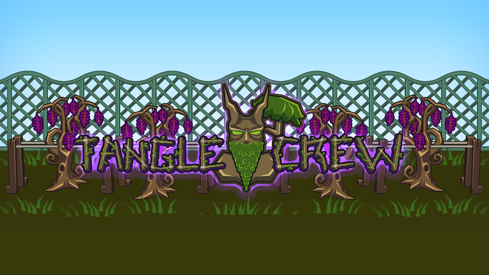

# Tanglebot

A Discord bot built for the **Tangle Crew** clan in [Old School RuneScape](https://oldschool.runescape.com/).

> **This bot was built with the assistance of [Claude](https://claude.ai/) by Anthropic — an AI coding assistant that helped design, write, debug, and iterate on all of the features described below.**

---

## Tangle Crew

| | |
|---|---|
| **Discord** | [https://discord.gg/tanglecrew](https://discord.gg/tanglecrew) |
| **Wise Old Man** | [wiseoldman.net/groups/12447](https://wiseoldman.net/groups/12447) |
| **OSRS Clan Finder** | [https://osrsclanfinder.com/clans/tangle-crew](https://osrsclanfinder.com/clans/tangle-crew) |

---

## Commands

| Command | What it does | Who can use it |
|---|---|---|
| [`/spinwheel`](#-spinwheel--prize-wheel) | Animated prize wheel that picks random winners | Coordinator |
| [`/donationhighscore`](#-donationhighscore--donation-high-scores) | Logs donations, posts the leaderboard, manages tier roles | Templar |
| [`/pethighscore`](#-pethighscore--pet-high-scores) | Logs pets, posts the leaderboard, manages the Pet Master role | Templar (`new`: Owner) |
| [`/refreshboards`](#-refreshboards--refresh-leaderboards) | Reposts both leaderboards from their sheets | Templar |
| [`/lfg-roles`](#-lfg-roles--activity-ping-roles) | Opt in/out of activity ping roles | Everyone |
| [`/lfg-post`](#-lfg-post--looking-for-group) | Creates an LFG group post in the forum | Everyone |
| [`/submission`](#-submission--proof-submission-help) | Proof formats, latest accepted proof, intake URL | Everyone (URL subcommands: Manage Server) |
| [`/channelmap`](#-channelmap--channel-id-for-the-web-panel) | Shows a channel's ID for the web panel | Manage Server |
| [`/weeklycomp`](#-weeklycomp--discord-event--wise-old-man-competitions) | Creates a Discord event plus WOM competitions | Templar |
| [`/weeklycompstats`](#-weeklycompstats--competition-leaderboard) | Standings for the running WOM competitions | Everyone |
| [`/stalemembers`](#-stalemembers--inactive-clan-members) | Lists WOM group members who gained too little XP over a number of months | Templar (posts in the admin log) |
| [`/honeypot`](#honeypot-channel-trap) | Test mode for the honeypot trap | Owner or Templar |

Role checks for **Templar** and **Owner** on the high score commands and `/refreshboards` fail **open**: if `TEMPLAR_ROLE_ID` / `OWNER_ROLE_ID` is unset, anyone can use them. `/spinwheel`, `/weeklycomp`, `/stalemembers` and `/honeypot` fail **closed**: if their role ID is unset, no one can.

---

### 🎡 `/spinwheel` — Prize Wheel

Spins an animated wheel and picks one or more random winners, for giveaways, loot splits, event prizes, or picking an activity.

| Option | Required | Description |
|--------|----------|-------------|
| `entries` | Yes | Comma-separated names or numeric ranges, e.g. `Alice,Bob,Carol`, `1-10`, or `Alice,1-5,Bob`. 2–50 entries after ranges expand. |
| `title` | No | Label on the wheel (default `Wheel Spin`) |
| `winners` | No | Winners to pick, 1–10 and fewer than the number of entries (default 1) |
| `message` | No | Win message, with `{winner}` as a placeholder (default `Winner is {winner}`) |
| `shuffle` | No | Shuffle the entries before spinning (default false) |
| `ping` | No | `@here` or `@everyone` when the winner is announced |

Ranges count either way (`5-1` counts down). Labels longer than 16 characters are cut short on the wheel.

**Requires** `COORDINATOR_ROLE_ID`.

<details>
<summary><strong>How it works</strong></summary>

1. The bot posts a GIF of the wheel spinning and easing to a stop on the first winner.
2. When the GIF finishes, it edits the message to show the winner(s) and every entry.
3. If `ping` was set, it sends the ping as a separate message, since edits don't notify.

</details>

---

### 💰 `/donationhighscore` — Donation High Scores

Tracks each member's total GP donated in a Google Sheet, posts a ranked leaderboard, and assigns stacking donation tier roles (Zenyte / Onyx / Dragonstone / Diamond / Ruby).

| Subcommand | Description |
|------------|-------------|
| `add` | Adds an amount to a member's total |
| `remove` | Subtracts an amount (never below 0) |

Both take a `player` and an `amount`: a raw number or shorthand like `10k`, `10m`, `10.1m` or `1b`.

<details>
<summary><strong>Environment variables</strong></summary>

| Variable | Required | Description |
|---|---|---|
| `DONATIONS_SHEET_ID` | Yes | The Google Sheet's ID. The command isn't loaded without this, `DONATIONS_CHANNEL_ID` and `GOOGLE_SERVICE_ACCOUNT_JSON`. |
| `DONATIONS_CHANNEL_ID` | Yes | Channel for the leaderboard. |
| `GOOGLE_SERVICE_ACCOUNT_JSON` | Yes | See [Google service account](#google-service-account). |
| `TEMPLAR_ROLE_ID` | Recommended | Restricts the command to Templars (fails open). |
| `DONATION_<TIER>_THRESHOLD` | No | GP needed per tier. Defaults: Zenyte 1B, Onyx 600M, Dragonstone 300M, Diamond 150M, Ruby 75M. |
| `DONATION_<TIER>_ROLE_ID` | No | Role granted at each tier. Leave blank to skip that tier's role. |
| `DEFAULT_EMBED_COLOR` | No | Embed color (default `006400`). |

`<TIER>` is `ZENYTE`, `ONYX`, `DRAGONSTONE`, `DIAMOND` or `RUBY`.

</details>

<details>
<summary><strong>How it works</strong></summary>

1. Reads the member's row from the `Donations` tab (by Discord ID), or adds one.
2. Updates their total and writes the row back.
3. Grants every tier role the new total qualifies for (a Zenyte donor also keeps Onyx, Dragonstone, Diamond and Ruby) and removes the rest.
4. Rebuilds the leaderboard: the combined total as the heading, then one line per donor with their highest tier's emoji, **display name** and total. The top donor's line is larger.
5. Edits the existing leaderboard messages in place. If the stored message IDs are missing, it finds its previous post in the channel's recent history instead of posting a duplicate.

Display names are refreshed from the server on every post. Members who left keep their last stored name.

</details>

<details>
<summary><strong>Setup</strong></summary>

1. Import `Tanglebot/example/donationhighscores_template.xlsx` at [sheets.google.com](https://sheets.google.com) with **File → Import → Upload → Create new spreadsheet**. Other import options can leave it in Office mode, which the Sheets API rejects with `must not be an Office file`. Keep the `Donations` tab name (`DiscordID`, `DisplayName`, `Donated` columns) and clear the example rows.
2. Share the sheet with your [service account](#google-service-account) as an **Editor**.
3. Set `DONATIONS_SHEET_ID` (from the URL: `docs.google.com/spreadsheets/d/<THIS_PART>/edit`) and `DONATIONS_CHANNEL_ID`.
4. Optionally set the tier thresholds and role IDs.

> The bot needs **Manage Roles**, with its role above the tier roles.

</details>

---

### 🐾 `/pethighscore` — Pet High Scores

Tracks which OSRS pets each member has in a Google Sheet, posts a ranked leaderboard, and grants a Pet Master role at a set pet count.

| Subcommand | Description |
|------------|-------------|
| `add` | Adds up to five pets to a member (`user`, `pet`, `pet2`–`pet5`) |
| `remove` | Removes up to five pets from a member |
| `new` | Adds a new pet type (`name`, `emoji`) to the `Pets` tab — **Owner only** |

Pet slots autocomplete and skip pets picked in another slot. Once `user` is set, `add` only suggests pets the member doesn't have and `remove` only suggests pets they do. For `new`, paste the custom emoji or its numeric ID. The pet is available in autocomplete immediately.

<details>
<summary><strong>Environment variables</strong></summary>

| Variable | Required | Description |
|---|---|---|
| `PET_HIGHSCORES_SHEET_ID` | Yes | The Google Sheet's ID. The command isn't loaded without this, `PET_HIGHSCORES_CHANNEL_ID` and `GOOGLE_SERVICE_ACCOUNT_JSON`. |
| `PET_HIGHSCORES_CHANNEL_ID` | Yes | Channel for the leaderboard. |
| `GOOGLE_SERVICE_ACCOUNT_JSON` | Yes | See [Google service account](#google-service-account). |
| `TEMPLAR_ROLE_ID` | Recommended | Restricts `add`/`remove` to Templars (fails open). |
| `OWNER_ROLE_ID` | Recommended | Restricts `new` to Owners (fails open). |
| `PET_MASTER_ROLE_ID` | No | Role granted at `PET_MASTER_THRESHOLD` pets. Leave blank to skip. |
| `PET_MASTER_THRESHOLD` | No | Pets needed for Pet Master (default 10). |
| `DEFAULT_EMBED_COLOR` | No | Embed color (default `006400`). |

</details>

<details>
<summary><strong>How it works</strong></summary>

1. Adds or removes every given pet in one sheet write, skipping pets already owned (`add`) or not owned (`remove`) and noting them in the reply. Pets are stored in `Pets` tab order.
2. Rebuilds the leaderboard sorted by pet count: 🥇🥈🥉 for the top three (ties share a medal), the member's **display name** and count, then a large row of their pet emojis.
3. Edits the existing leaderboard messages in place, the same way as `/donationhighscore`.
4. Grants or removes Pet Master when the member's count crosses the threshold.

</details>

<details>
<summary><strong>Setup</strong></summary>

1. Import `Tanglebot/example/pethighscores_template.xlsx` the same way as the donations template. Keep both tab names:
   - `Highscores` — `DiscordID`, `DisplayName`, `Pets`. `Pets` is a comma-separated list of pet **keys** (e.g. `baby_mole, heron`), not names.
   - `Pets` — `Key`, `Name`, `EmojiID`, pre-filled with every pet. Row order is display order.
2. Share the sheet with your [service account](#google-service-account) as an **Editor**.
3. Set `PET_HIGHSCORES_SHEET_ID` and `PET_HIGHSCORES_CHANNEL_ID`, and optionally `PET_MASTER_ROLE_ID` / `PET_MASTER_THRESHOLD`.
4. Fill in each pet's `EmojiID` with its custom emoji ID. Pets without one show ❔.

Hand edits to the `Pets` tab take effect on the next restart or `/refreshboards`. Pets added with `/pethighscore new` are available immediately.

> The bot needs **Manage Roles**, with its role above Pet Master.

</details>

---

### 🔄 `/refreshboards` — Refresh Leaderboards

Reposts the pet and donation leaderboards from their Google Sheets, e.g. after editing a sheet by hand. The reply says whether each board was refreshed, skipped (env vars not set) or failed, with the error. The same refresh runs on startup.

Requires `GOOGLE_SERVICE_ACCOUNT_JSON` to load. Restricted to Templars (`TEMPLAR_ROLE_ID`, fails open).

---

### 🔔 `/lfg-roles` — Activity Ping Roles

Opens a private menu for opting in to ping roles for bosses, raids and minigames, so members only get pinged for what they care about. Groups made with `/lfg-post` ping these roles.

<details>
<summary><strong>How it works</strong></summary>

1. The menu has a button per category (**Bosses**, **Raids**, **Minigames**) and **Clear All LFG Roles**.
2. A category opens its activities in alphabetical order. Clicking one toggles its role. Roles you have show red.
3. Menus delete themselves after 60 seconds. Your roles stay.
4. Anyone can `@mention` a role to ping everyone who opted in.

</details>

<details>
<summary><strong>Setup</strong></summary>

Activities are defined in `CATEGORIES` in `src/utils/roleMenu.js`. Each role (`LFG-<activity>`, e.g. `LFG-Yama`) is created on first use with the activity's color, plus its emoji as the role icon on servers with role icons (Boost Level 2+). On startup, if `CLAN_ID` is set, the bot applies `CATEGORIES` colors and icons to existing `LFG-` roles.

The bot needs **Manage Roles**, with its role above the `LFG-` roles. `ADMIN_LOG_CHANNEL_ID` (optional) receives role errors and misconfigured activities.

</details>

---

### 🔍 `/lfg-post` — Looking For Group

Creates a forum post where members can join a group for an activity, with a role ping, a live member list, a queue, and automatic cleanup.

<details>
<summary><strong>Environment variables</strong></summary>

| Variable | Required | Description |
|---|---|---|
| `LFG_FORUM_CHANNEL_ID` | Yes | Forum Channel for group posts. The command isn't loaded without it. |
| `COORDINATOR_ROLE_ID` / `OWNER_ROLE_ID` | No | Staff who can Start Now, Disband, Cancel Disband and confirm Still Here on any group. |
| `SUPABASE_URL` + `LFG_PLUGIN_TOKEN` | No | Mirrors groups to the shared LFG backend used by the RuneLite plugin. |
| `LFG_DELIVERY_SECRET` | No | Also needed to push the activity catalog on startup and to deliver plugin-created groups into Discord. |
| `ADMIN_LOG_CHANNEL_ID` | No | Receives setup errors and backend sync failures. |

</details>

<details>
<summary><strong>How it works</strong></summary>

1. A private menu asks for **Category** → **Activity** → **Group Size** (up to the activity's max, some with a **Mass** option) → **Start Time** (Now, 15 or 30 minutes, or 1–6 hours from now), then an optional description.
2. The bot creates a post titled like `[Open] - Bosses: Yama - Start: in 15 Min`, pinging the activity's role and listing the details and members. The title's countdown updates as the start approaches, and `[Open]` becomes `[Full]` when the group fills.
3. Buttons on the post:
   - **Join Group** — joins, or joins the queue if the group is full.
   - **Leave Group** — leaves the group or the queue.
   - **Start Now** — starts the group immediately (members or staff).
   - **Disband Group** — closes the post after a 1-minute grace period with a **Cancel Disband** button (members or staff; anyone in the group or queue can cancel).
4. Joins and leaves post a notice without pinging the group. Filling up pings everyone with "Group formed, Good luck!"
5. When a spot frees up in a full group, the first person in the queue gets **Accept Spot** / **Decline Spot** for 5 minutes. Declining or not answering removes them from the queue, and the spot goes to the next person. With nobody queued, the group reopens.
6. An empty group closes after 15 minutes unless someone rejoins.
7. Every 2 hours, starting no earlier than the start time, the group is asked if it's still active. No **Still Here** click within 10 minutes disbands it.
8. On startup the bot posts or updates a pinned **Start Here** post in the forum explaining all of this.

Groups survive restarts: each change is saved to `Tanglebot/data/lfg-groups.json`, and on startup the bot restores them and restarts their timers from that moment. A group that was closing gets a fresh 1-minute countdown with **Cancel Disband**, an empty one a fresh 15 minutes, and a spot held for the queue is offered again. If the save file doesn't have a group, the bot rebuilds it from its post in the forum; posts it can't read get their buttons removed, and the admin log lists both.

</details>

<details>
<summary><strong>Shared LFG backend (RuneLite plugin)</strong></summary>

With `SUPABASE_URL` and `LFG_PLUGIN_TOKEN` set, `/lfg-post` groups are mirrored to the shared Supabase backend so the RuneLite plugin can see them. With `LFG_DELIVERY_SECRET` too, the bot pushes its activity catalog (from `roleMenu.js`) on startup and polls for plugin-created groups, posting each as its own thread.

Plugin-created posts have **Join Group**, **Leave Group** and **Close Group** buttons, enabled per the group's status (`OPEN`, `FULL`, `STARTED`, `CLOSED`, `CANCELLED`, `EXPIRED`). Join stays enabled when the group is full, because the backend queues the player.

</details>

<details>
<summary><strong>Setup</strong></summary>

Point `LFG_FORUM_CHANNEL_ID` at a Forum Channel. The bot needs **Manage Threads** there, and **Manage Roles** for the activity roles (shared with `/lfg-roles`). A forum tag named after an activity (e.g. `Yama`) is applied to its posts automatically.

</details>

---

### 🧾 `/submission` — Proof Submission Help

| Subcommand | Description |
|------------|-------------|
| `format` | Posts the KC and drop proof formats |
| `last` | Shows the latest accepted proof submission |
| `showintakeurl` | Shows the KC intake URL in use (Manage Server) |
| `setintakeurl` | Overrides the intake URL without a restart (Manage Server) |

`format` and `last` reply publicly unless `private` is set. The URL subcommands always reply privately. The override is saved in `Tanglebot/data/` and takes precedence over `SUPABASE_DISCORD_KC_INTAKE_URL`.

`last` only has something to show once [KC and Drop Proof Intake](#kc-and-drop-proof-intake) has accepted a submission.

---

### 🧭 `/channelmap` — Channel ID for the Web Panel

Replies privately with a channel's ID (the current channel, or the `channel` option) and the values to set on its `event_discord_channels` row in the web panel. Requires **Manage Server**.

---

### 🏆 `/weeklycomp` — Discord Event + Wise Old Man Competitions

Creates a Discord scheduled event and one Wise Old Man competition per boss or skill, in one step.

| Option | Required | Description |
|--------|----------|-------------|
| `prefix` | Yes | Name prefix. Each competition is named `<prefix> <metric>`, e.g. `BOTW T3 Vorkath`, without a leading "The". |
| `metric` | Yes | Boss or skill. Autocompletes over every boss and skill WOM tracks. |
| `metric2`–`metric4` | No | More bosses or skills, each with its own competition. |
| `start` | Yes | Eastern Time date: `YYYY-MM-DD`, `YYYY/MM/DD` or `MM/DD/YYYY`, optionally with an hour (`18` or `6pm`). ISO 8601 with an offset also works. Must be in the future. |
| `duration` | No | Days, 1–365 (default 7). |
| `group_id` | No | WOM group ID. Only shown when `WOM_GROUP_ID` isn't set. |
| `verification_code` | No | WOM verification code. Only shown when `WOM_GROUP_VERIFICATION_CODE` isn't set. |

Replies privately. **Requires** `TEMPLAR_ROLE_ID`.

<details>
<summary><strong>Environment variables</strong></summary>

| Variable | Required | Description |
|---|---|---|
| `TEMPLAR_ROLE_ID` | Yes | The role that can run the command, and the role the ending reminder pings. |
| `WOM_GROUP_ID` | Recommended | Your WOM group. Also enables the ending reminder. |
| `WOM_GROUP_VERIFICATION_CODE` | Recommended | wiseoldman.net → your group → settings → Verification Code. Also used by the reminder's update all. |
| `WOM_API_KEY` | No | Raises WOM's rate limit from 20 to 100 requests a minute. Ask on the Wise Old Man Discord. |
| `ADMIN_LOG_CHANNEL_ID` | No | Logs each run and any failures, and receives the ending reminder. |

</details>

<details>
<summary><strong>How it works</strong></summary>

1. Shows a private confirmation with the metrics, start, end and duration. Nothing is created unless **Confirm** is clicked within 60 seconds.
2. Creates one WOM competition per metric in the group, so its members are tracked automatically.
3. Creates a Discord event named `<prefix> <first metric>`, with every competition's link in the description and the first metric's WOM image as the cover.
4. Replies with the links and logs to the admin log. If anything fails, the reply and the log list what was created.

</details>

<details>
<summary><strong>Competition ending reminder (automatic)</strong></summary>

Every 15 minutes (on the quarter hour, and once on startup) the bot checks the WOM group for competitions ending within the hour. For those it finds, it:

1. Runs **update all** on the group, then waits 5 minutes if any players were queued.
2. Posts **one** message in `ADMIN_LOG_CHANNEL_ID` pinging `TEMPLAR_ROLE_ID`, with the top 3 of each ending competition.
3. Adds a combined top 5 for each category (bossing, skilling, …) with two or more ending competitions.

Each competition is reminded once. The bot checks the admin log channel for its earlier reminders, so this survives restarts and deploys. It needs **Read Message History** in that channel, or no reminder is sent.

Needs `WOM_GROUP_ID` and `ADMIN_LOG_CHANNEL_ID`.

</details>

---

### 📊 `/weeklycompstats` — Competition Leaderboard

Shows the standings for every WOM competition the group is running. Anyone can use it; the reply is public. Each person can run it once a minute.

| Option | Required | Description |
|--------|----------|-------------|
| `player` | No | A RuneScape name. Opens on that player's page, highlights them, and shows their rank on each leaderboard. Autocompletes from the last fetched standings. |

<details>
<summary><strong>Environment variables</strong></summary>

| Variable | Required | Description |
|---|---|---|
| `WOM_GROUP_ID` | Yes | Your WOM group. The command isn't loaded without it. |
| `WOM_API_KEY` | No | Raises WOM's rate limit from 20 to 100 requests a minute. |
| `ADMIN_LOG_CHANNEL_ID` | No | Receives an alert, naming who ran the command, when loading or replying fails. |

</details>

<details>
<summary><strong>How it works</strong></summary>

1. Lists each running competition with its total (**Total KC** for bosses, **Total gained** otherwise) and active participants (e.g. `43/264 active`). ⏰ marks competitions ending within 24 hours. Times use Discord timestamps, so they show in each viewer's timezone.
2. Competitions in the same category are summed per player, with each competition's gains shown underneath. Categories are never mixed and sit side by side.
3. Players with gains are listed 10 per page, with 🥇🥈🥉 for the top 3. Ties share a rank.
4. **◀ Prev** / **Next ▶** work for 14 minutes, only for whoever ran the command.
5. If nothing is running, it names the next competition(s) and when they start.

Standings are fetched at most every 5 minutes and shared between runs; sooner when a competition starts or ends or `/weeklycomp` creates one, and 1 minute after an error. Gains are only as fresh as each player's last WOM update. The command doesn't run update all.

</details>

---

### 💤 `/stalemembers` — Inactive Clan Members

Lists every member of the WOM group who gained less than a set amount of overall XP over the last few months, longest inactive first. For example, `/stalemembers time: 6 minxp: 250k ignore: Owner, Deputy Owner, Templar` lists everyone outside those ranks who gained less than 250k XP in the last 6 months, plus anyone within 2 weeks of having been inactive that long. The list is always posted in the admin log channel, for everyone there to see. Run from any other channel, it's still posted there and you get a private reply with a link to it. Errors reply privately. **Requires** `TEMPLAR_ROLE_ID` and `ADMIN_LOG_CHANNEL_ID`.

| Option | Required | Description |
|--------|----------|-------------|
| `time` | Yes | How many months back to check (1–60). |
| `minxp` | Yes | The XP they must have gained, at least 1, e.g. `250k`, `1.5m` or `250,000`. |
| `ignore` | No | Clan ranks to leave out, comma separated, e.g. `Owner, Templar, Gnome Child`, or `None` to check every rank. Uses WOM's rank names, in any case. Autocompletes from the ranks the group uses, in rank order; any WOM rank can still be typed in full, but only the group's show on the list. Leave it empty to tick the ranks from a list instead (see below). |

**Rank picker:** run it without `ignore` (e.g. `/stalemembers time: 6 minxp: 250k`) and you privately get a tick box of the clan's ranks, with their emojis, and a **▶ Run** button. As you tick ranks, the message shows the matching command with `ignore` filled in, ready to copy and paste next time. Run posts the list as usual and leaves you the link and the command. The picker works for Templars only, and after a restart too.

<details>
<summary><strong>Environment variables</strong></summary>

| Variable | Required | Description |
|---|---|---|
| `TEMPLAR_ROLE_ID` | Yes | The role that can run the command and use its buttons. The command isn't loaded without it. |
| `ADMIN_LOG_CHANNEL_ID` | Yes | Where every list is posted, wherever the command is run. Also receives an alert, naming who ran the command, when loading or replying fails. The command isn't loaded without it. |
| `WOM_GROUP_ID` | Yes | Your WOM group. The command isn't loaded without it. |
| `WOM_GROUP_VERIFICATION_CODE` | No | Enables the 🔃 Refresh WOM button, which runs update all on the group. |
| `WOM_API_KEY` | No | Raises WOM's rate limit from 20 to 100 requests a minute. |

</details>

<details>
<summary><strong>How it works</strong></summary>

1. Loads the group's members and their overall XP gained over the window from WOM (2 requests).
2. Members in an ignored rank are skipped, and so is anyone who joined the WOM group during the window, since they haven't had the whole window to gain XP. The join date is the earlier of WOM's two (when WOM added them, and the clan join the RuneLite plugin reports), so someone WOM re-added after a name change keeps their original date. Page 1 says how many were skipped.
3. Everyone else who gained less than `minxp` is listed with their rank's emoji, XP gained and how long ago WOM last saw their stats change, in months and weeks (e.g. `last active 6 months, 2 weeks ago`) with the date.
4. Members who gained more than `minxp`, but haven't been active for all but the last 2 weeks of the window, are listed too as close. They're marked ⌛ with when they'll have been inactive for the whole window, counting down live (e.g. `⌛ 6 months inactive in 9 days`), and counted separately on page 1.
5. The list is sorted by that last change, oldest first. Members WOM has never seen change come first.
6. Members WOM has no data for in the window (e.g. never tracked) count as 0 XP and show **no WOM data**. ⏳ marks members WOM hasn't updated in over 7 days, so they may have gains WOM hasn't seen. ❓ marks members WOM can't track (unranked, flagged, archived or banned on WOM), whose XP may be wrong.
7. The first page shows when the list was checked and by whom (in each viewer's local time), the options, the totals, what the markers in this list mean (only the ones it uses, so the legend changes when an Update or Refresh adds or removes one), what the buttons do (Discord buttons can't show a description on hover), and the first 10 members. Later pages hold as many members as page 1 has lines (up to 24), and the last page is padded with blank lines, so every page is about the same height.
8. **◀ Prev** / **Next ▶**, **🔄 Update**, **🔃 Refresh WOM** and **📄 Export** work for any Templar, with no time limit.
   - Update reloads the list from WOM with the same options and stays on the same page.
   - Refresh WOM runs WOM's update all, so every member is re-checked on the hiscores, and privately says how many were queued and when the list will update, as a local time with a live countdown (e.g. "at 3:05 PM (in 5 minutes)"). When it's done, that message changes to say it finished. Update all covers the whole group, so only one refresh runs at a time: if someone presses Refresh during the wait, on any list, they're told privately who started it and when it finishes, and they're DMed too when it's done. After 5 minutes (the same wait as the competition reminder) it reloads the newest list and DMs everyone waiting a link to it. Anyone with DMs closed is pinged in the admin log channel instead. A bot restart during the wait cancels the reload and the message. Only shown when `WOM_GROUP_VERIFICATION_CODE` is set.
   - When another feature runs update all (the [competition ending reminder](#-weeklycomp--discord-event--wise-old-man-competitions)), the newest list also reloads on its own 5 minutes later, so that one update all serves both. Page 1 then shows the time with "auto refreshed" (the export says what triggered it). Refresh presses during that wait join it, as above.
   - Export privately sends the whole list as a CSV file that opens in Excel or Google Sheets, named `stale-members-export-<date>_<time>.csv` (UTC; a second export in the same second gets `_2`). It starts with when the data was checked and by whom, who exported it and when, and the options, then lists each member's name, rank, status (stale, or close with the date they reach the window), XP gained, dates and notes. A copy is saved in `data/stalemembers-exports/`, keeping the newest 5.
9. Running the command again deletes the previous list once the new one is posted, so only one shows. The newest list's message ID is saved in `data/stalemembers.json`, so this still works after a restart. If two runs finish at the same time, the later list is kept.
10. Lists are kept in memory until the bot restarts. After that, Prev/Next/Export say the list has expired and give the command to copy and run again (e.g. `/stalemembers time:6 minxp:250k ignore:Owner, Templar`), and Update reloads the list from the options stored on the button.
11. If WOM can't be reached, the "thinking" message is removed and the error is shown only to whoever ran the command.

Gains are only as fresh as each player's last WOM update; 🔃 Refresh WOM brings everyone up to date first. "Last active" counts any stat change WOM saw, boss kills included, not just XP.

Rank emojis are the bot's own application emojis (uploaded from `assets/icons/clan_ranks`), matched to ranks by name and loaded once. A rank with no emoji, or every rank if loading them fails, shows its name instead.

The group's ranks are loaded from WOM on startup for autocomplete and reused for 30 minutes. If they can't be loaded, autocomplete only suggests `None`; ranks can still be typed.

</details>

---

## Message Features

### KC and Drop Proof Intake

Watches submission channels for KC and drop proof posts and forwards valid ones to the site for manual review.

<details>
<summary><strong>Environment variables</strong></summary>

| Variable | Description |
|---|---|
| `SUPABASE_URL` | Supabase project URL (shared with the LFG backend). |
| `SUPABASE_SERVICE_ROLE_KEY` | Used to look up `event_discord_channels`. |
| `SUPABASE_DISCORD_KC_INTAKE_URL` | Where submissions are sent. Can be overridden with `/submission setintakeurl`. |
| `DISCORD_KC_INTAKE_SECRET` | Shared secret sent with each submission. |

Set all four or none. Setting only some stops the bot at startup.

</details>

<details>
<summary><strong>How it works</strong></summary>

A channel is a submission channel if `event_discord_channels` has a row with its `channel_id` and `channel_kind = submission` (cached for a minute). In those channels, a message with an image or any proof field is treated as a submission; other chatter is ignored.

KC format (`Monster being Killed` is optional):

```text
Task name on Board: <tile title>
Monster being Killed: <monster name>
Starting or Ending: Starting
Starting Kill Count: 1234
```

Drop format:

```text
Task name on Board: <tile title>
Item Dropped: <item name>
```

Each submission needs exactly one image. For ending KC, `Starting or Ending: Ending`, `Ending Kill Count: 1234` or `Kill Count: 1234` all work. Invalid submissions get a reply with the formats. If the Supabase lookup fails, the bot asks the user to try again.

</details>

---

### Announcement Channel Cleanup

When a followed announcement's original post is deleted, Discord replaces the local copy with `[Original Message Deleted]`. The bot deletes those messages in `ANNOUNCEMENT_CHANNEL_ID`. It needs **Manage Messages** there. Leave the variable blank to disable.

---

### Honeypot Channel Trap

Turns one or more channels into traps for scam bots and compromised accounts.

<details>
<summary><strong>How it works</strong></summary>

On startup each trap channel is cleared and a warning is posted. When anyone (except bots) posts there, the bot:

1. Times them out for 1 week.
2. Deletes the message, keeping up to 10 of its images.
3. Posts a report with the images to `ADMIN_LOG_CHANNEL_ID`, with two buttons:
   - **Ban & Delete Messages** — bans the account and has Discord delete their messages from the last 7 days in every channel and thread. If the ban fails, the bot instead deletes any of their messages among the last 100 in each channel it can see.
   - **False Positive (Un-Timeout)** — lifts the timeout.

Only Owners and Templars can use the buttons. After a click, the buttons are removed and the report records the action, who took it and when.

`/honeypot testmode true` turns on test mode: the trap still reports and the buttons still work, but nobody is timed out, banned or has messages deleted. `/honeypot testmode false` turns it off, and `/honeypot status` shows the current mode.

</details>

<details>
<summary><strong>Environment variables</strong></summary>

| Variable | Required | Description |
|---|---|---|
| `HONEYPOT_CHANNEL_ID` | One of these two | A text channel to trap. |
| `HONEYPOT_VOICE_CHANNEL_ID` | One of these two | A voice channel's text chat to trap. |
| `ADMIN_LOG_CHANNEL_ID` | Recommended | Where reports go. Without it the poster is still timed out, but nothing is reported. |
| `OWNER_ROLE_ID` / `TEMPLAR_ROLE_ID` | Recommended | Who can use the buttons and `/honeypot` (fails closed). |

`/honeypot` is only loaded when a trap channel is set.

> The bot needs **Manage Messages** in each trap channel, **Moderate Members** for timeouts, and **Ban Members** for the ban button.

</details>

---

## Setup

### Prerequisites

- [Node.js](https://nodejs.org/) 22 or later (or Docker)
- A Discord application and bot token from [discord.com/developers](https://discord.com/developers/applications)
- **Server Members Intent** and **Message Content Intent** enabled for the bot. It requests both at startup and can't log in without them.

### Install

```bash
cd Tanglebot
npm install
cp .env.example .env
```

### Environment variables

Each feature's variables are listed in its section above. These are the base ones:

| Variable | Description |
|---|---|
| `DISCORD_BOT_TOKEN` | Required. The bot won't start without it. |
| `CLIENT_ID` | Your application ID. |
| `CLAN_ID` | Your server ID. With `CLIENT_ID`, used to register the slash commands. Also used for the leaderboards and the `LFG-` role sync. |
| `ADMIN_LOG_CHANNEL_ID` | Optional. Staff channel for alerts, logs and the "Bot is online" message (which pings `OWNER_ROLE_ID` if set). |
| `OWNER_ID` | Unused. |

### Google service account

`/donationhighscore` and `/pethighscore` write to Google Sheets, which needs a service account.

<details>
<summary><strong>Steps</strong></summary>

1. In the [Google Cloud Console](https://console.cloud.google.com/), create or pick a project.
2. Enable the **Google Sheets API**.
3. **APIs & Services → Credentials → Create Credentials → Service account**. Any name works; skip the optional steps.
4. Open the service account → **Keys → Add Key → Create new key → JSON**. Keep the downloaded file secret.
5. Share each sheet with the key's `client_email` as an **Editor**.
6. Put the key in `.env` as one line:
   ```bash
   node -e "console.log(JSON.stringify(require('./path/to/key.json')))"
   ```
   Paste the output as the value of `GOOGLE_SERVICE_ACCOUNT_JSON`, without quotes.

</details>

### Run

```bash
npm start
```

The bot registers its slash commands with your server each time it starts. `npm run deploy` registers them without starting the bot.

To run with Docker instead, use `docker compose up -d --build` from the repo root. It reads `Tanglebot/.env` and keeps `Tanglebot/data/` between restarts.

`Tanglebot/data/` holds small state files: leaderboard message IDs, open LFG groups, the LFG start post ID, honeypot test mode, the intake URL override, and the last accepted submission.

---

## Built With

- [discord.js](https://discord.js.org/) v14
- [@napi-rs/canvas](https://github.com/Brooooooklyn/canvas) and [gif-encoder-2](https://github.com/benjaminadk/gif-encoder-2) — the `/spinwheel` GIF
- [googleapis](https://github.com/googleapis/google-api-nodejs-client) — Google Sheets for the high score commands
- [axios](https://axios-http.com/) — Supabase and the LFG backend
- [@wise-old-man/utils](https://github.com/wise-old-man/wise-old-man) — Wise Old Man API client
- [Claude by Anthropic](https://claude.ai/) — AI-assisted development

---

## License

[MIT](LICENSE)
